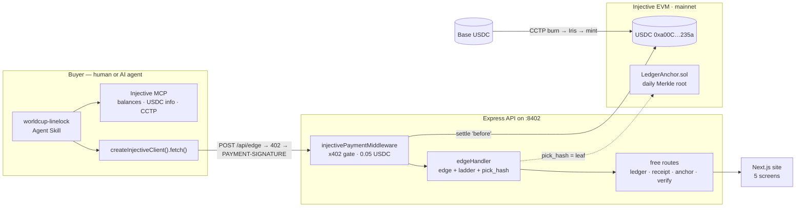

<div align="center">
  
  <h1>LineLock</h1>
  <p><em>Lock the line. Prove the pick. — a pay-per-pick World Cup edge API on Injective x402, with a free CLV-scored public ledger.</em></p>
  

  <br/><br/>

  [](https://linelock.edycu.dev/)
  [](https://linelock.edycu.dev/pitch/)
  [](https://linelock-production.up.railway.app/api/ledger)
  [](https://youtu.be/MHHYIJkLRbo)
  

  <br/>

  
  
  
  
  
  
  
  [](LICENSE)
  [](https://github.com/edycutjong/linelock/actions/workflows/ci.yml)
</div>

<p align="center"><code>Injective x402</code> · <code>USDC CCTP</code> · <code>MCP Server</code> · <code>Agent Skills</code> · <code>Injective EVM contract</code> · <code>Express</code> · <code>Next.js 14</code></p>

<p align="center">🌐 <strong><a href="https://linelock.edycu.dev/">Landing page</a></strong> · 📊 <strong><a href="https://linelock.edycu.dev/pitch/">Pitch deck</a></strong> (interactive — arrow keys · press <kbd>P</kbd> to print/PDF)</p>

---

> **Every World Cup tipster shows you screenshots. LineLock shows you receipts.**

A pay-per-pick World Cup edge API on **Injective EVM** where the **x402 USDC receipt IS the pre-kickoff
timestamp**, plus a **free public ledger** that CLV-scores every settled pick — losses included.

**The one flow, with depth:**
`pay x402 → edge + conviction ladder returned → receipt = pre-kickoff proof → match settles → CLV scored → public ledger row`

Buy the next pick for 5 cents. Audit every past pick for free.

**What's built & green today (no funds needed):** 70 passing tests, a **live HTTP 402** quote from the
real `@injectivelabs/x402` middleware, a 5-screen Next.js ledger site, an independent audit CLI, and an
on-chain **Merkle anchor** contract. The single thing gated on wallet funding is the *real paid mainnet
receipt* — and the code [refuses to fabricate it](scripts/paid-call-smoke.ts).

## 🚀 Quickstart (no funds needed for the 402 proof)

```bash
npm install
npm run settle           # build the CLV ledger from fixtures/picks.csv (24 rows)
npm test                 # 70 tests: CLV · edge · ladder · hash · similar · invariants I1–I5 · settle · 402 handshake
npm run api &            # boot the Express API on :8402 (x402 gate ON)
curl -i -X POST http://localhost:8402/api/edge   # → HTTP 402 + a real x402 quote (no funds)
npm run buyer            # parse that quote with the first-party client
kill %1                  # stop the gated API (frees :8402), then:
npm run api -- --demo &  # same API, x402 gate OFF → the paid 200 payload without funds
curl -s -X POST http://localhost:8402/api/edge   # → 200: edge + ladder + similar_settled (receipt:null)
npm run audit -- --all   # independently re-audit the whole ledger → "LEDGER PASSES"
# the ledger site:
cd web && npm install && npm run dev  # → http://localhost:3402
```

### The 402 handshake — real, from the real middleware, zero funds

```
$ curl -i -X POST http://localhost:8402/api/edge

HTTP/1.1 402 Payment Required
PAYMENT-REQUIRED: eyJ4NDAyVmVyc2lvbiI6MiwiZXJyb3IiOiJQQVlNRU5U...   (base64 mirror of the body)
Content-Type: application/json

{
  "x402Version": 2,
  "error": "PAYMENT-SIGNATURE header is required",
  "resource": { "url": "http://localhost:8402/api/edge", "description": "LineLock — one World Cup knockout edge…" },
  "accepts": [{
    "scheme": "exact",
    "network": "eip155:1776",
    "amount": "50000",
    "payTo": "0x45078eD96C2bB171009A47a57aF5C085Bf4fD0e3",
    "maxTimeoutSeconds": 120,
    "asset": "0xa00C59fF5a080D2b954d0c75e46E22a0c371235a",
    "extra": { "name": "USDC", "version": "2", "assetTransferMethod": "eip3009" }
  }]
}
```

That quote is produced by the real `@injectivelabs/x402` middleware, needs no wallet funds, and parses
cleanly with the package's own `parsePaymentRequired()` (see `test/handshake.test.ts`).

### The actual paid payload — witnessed without funds (`--demo`)

The same `POST /api/edge` returns the real edge payload once you run the server with the gate disabled —
no funds, and it labels itself as unpaid (`receipt: null`, `note: "Demo/unsettled response"`):

```jsonc
$ npm run api -- --demo &   # same server, x402 gate OFF
$ curl -s -X POST http://localhost:8402/api/edge
{
  "side_label": "France to advance",
  "model_prob": 0.58, "edge_pct": 0.0922, "recommended_tier": 2,
  "ladder": [ /* 4 conviction rungs */ ],
  "pick_hash": "f7ad4164…588c22",
  "similar_settled": [
    { "fixture": "FRA vs AUS", "edge_pct": 0.0922, "result": "win", "clv_pct":  0.0904 },
    { "fixture": "ENG vs SUI", "edge_pct": 0.0895, "result": "win", "clv_pct":  0.0756 },
    { "fixture": "CRO vs CAN", "edge_pct": 0.0852, "result": "win", "clv_pct": -0.0612 }
  ],
  "receipt": null,
  "note": "Demo/unsettled response (no on-chain receipt bound)."
}
```

`similar_settled` is drawn from LineLock's **own** settled ledger, losses included (I3) — note
`CRO vs CAN`: a **win that lost CLV**. The system publishes its own bad prices. The `receipt` field is
where the USDC tx lands; its block time is the pre-kickoff proof (I1). See [`DEMO.md`](docs/DEMO.md) for the
full ~25-second "402 → `--demo` 200 → `audit --all`" magic-moment beat.

## 🧑‍⚖️ Notes for judges

- **Keyless — nothing to sign up for.** No account, no login, no API key to witness the paid gate.
  `curl -i -X POST :8402/api/edge` returns a real HTTP 402 quote. The data-API responses are cached in
  the repo, so `settle`, the ledger, the audit, and the site all run with an **empty `.env.local`**.
- **The 402 proof runs with zero funds.** The quote is built from config by the real middleware — it
  needs no wallet balance. Only *settling* a real payment needs gas, and
  [`scripts/paid-call-smoke.ts`](scripts/paid-call-smoke.ts) does a balance preflight and **refuses to
  fabricate a receipt** when the wallet is unfunded (it exits, it never fakes one).
- **Witness the paid 200 without funds, then recompute the ledger.** `npm run api -- --demo` disables the
  gate so `POST /api/edge` returns the actual payload a buyer gets — edge, conviction ladder, and
  `similar_settled` (losses included) — self-labeled `receipt: null`. Then `npm run audit -- --all`
  re-hashes every pick and recomputes every Merkle root → **"LEDGER PASSES"**. That ~25-second beat
  (402 → `--demo` 200 → audit) is the whole product, witnessed with zero funds — see [`DEMO.md`](docs/DEMO.md).
- **Reproduce the whole core in <5 minutes:**
  ```bash
  git clone https://github.com/edycutjong/linelock-inj && cd linelock-inj
  npm install
  npm test                                        # 70 green: CLV · invariants I1–I5 · 402 handshake
  npm run settle && npm run audit -- --all        # build the ledger, then independently re-audit it
  npm run api & sleep 1                           # API on :8402
  curl -i -X POST http://localhost:8402/api/edge  # → HTTP 402 + a real x402 quote, zero funds
  ```
- **What is honestly pending** (all user- or funds-gated, and never faked): a live deploy URL, a recorded
  demo video, and the first *real* on-chain paid receipt. Status is tracked in [`STATUS.md`](docs/STATUS.md).

## 🏗️ Architecture



The whole system exists to make one flow undeniable: **pay → the receipt is the pre-kickoff proof → the
match settles → CLV scores the pick → it lands on the public ledger.** Full request-path table and the
exact x402 wiring are in [`ARCHITECTURE.md`](docs/ARCHITECTURE.md).

---

## 🛠️ Injective technologies used

Five honestly-named Injective surfaces, each load-bearing:

### 1. x402 — `@injectivelabs/x402`
- **Server:** `injectivePaymentMiddleware(routes, options)` gates `POST /api/edge` at **0.05 USDC**
  (`50000` units) on mainnet USDC `0xa00C59fF5a080D2b954d0c75e46E22a0c371235a`, network
  `eip155:1776`. Code: [`api/middleware.ts`](api/middleware.ts), wired in [`api/server.ts`](api/server.ts).
- **Client:** `createInjectiveClient({ privateKey }).fetch(url)` auto-handles the 402 and signs an
  **EIP-3009** authorization; `parsePaymentRequired` / `parsePaymentResponseHeader` read the quote +
  receipt. Code: [`scripts/buyer.ts`](scripts/buyer.ts), [`scripts/paid-call-smoke.ts`](scripts/paid-call-smoke.ts).
- **Why it's the whole product:** the payment tx's **block time < kickoff** is the notarization — the
  receipt *is* the pre-kickoff proof, bound to `pick_hash` in the same ledger row (invariant I1).

### 2. MCP Server — `InjectiveLabs/mcp-server` (buyer side, driven by the Skill)
- `account_balances` (pre-purchase USDC check) · `usdc_native_info` (pin the asset address + decimals,
  never hardcode from docs) · `address_normalize` (`inj1…` ↔ `0x…`) · CCTP tool family. Documented in
  [`skills/worldcup-linelock/SKILL.md`](skills/worldcup-linelock/SKILL.md). Hosted **Documentation
  MCP** (`SearchInjectiveDocs`) used at build time to pin the surface.

### 3. Agent Skills — shipped `worldcup-linelock`
- An installable markdown skill that teaches any harness to be a buyer: balance → pay → validate hash →
  audit. `npx skills add https://github.com/edycutjong/linelock-inj --skill worldcup-linelock`. It is the
  distribution channel — any agent becomes a customer with no API key.
  Code: [`skills/worldcup-linelock/SKILL.md`](skills/worldcup-linelock/SKILL.md).

### 4. USDC CCTP V2 — cross-chain buyer funding
- Base (domain 6) burn → Iris attestation (`iris-api.circle.com`) → `cctp_mint` on Injective.
  TokenMessengerV2 `0x28b5a0e9C621a5BadaA536219b3a228C8168cf5d`. Wiring + honest funding status in
  [`STATUS.md`](docs/STATUS.md) and [`DEMO.md`](docs/DEMO.md).

### 5. Injective EVM smart contract — `LedgerAnchor.sol`
- ~40-line write-once daily **Merkle checkpoint** of pick hashes (event `AnchorPosted(day, root, count)`),
  built/deployed via the official **`injective-evm-developer`** Agent Skill. Receipts prove *when each
  pick existed*; the anchor proves *the ledger DB was never rewritten* (invariant I5). Code:
  [`contracts/LedgerAnchor.sol`](contracts/LedgerAnchor.sol), deploy notes [`contracts/DEPLOY.md`](contracts/DEPLOY.md).

> **x402: the real surface (spec correction).** The sibling `ARCHITECTURE.md` sketch shows a *flat*
> `injectivePaymentMiddleware({ endpoint, network, asset, amount })`. The **shipped** `dist/*.d.ts`
> types (verified 2026-07-12) use a **routes map**: `injectivePaymentMiddleware(routes, options)` where
> `routes["POST /api/edge"] = { description, accepts: [{ network, asset, amount, payTo }] }` and
> `options = { facilitator: { privateKey }, settlementPolicy }`. We build against the shipped types; the
> flat sketch is outdated. Headers are v2: 402 carries `PAYMENT-REQUIRED`, the client sends
> `PAYMENT-SIGNATURE`, and the 200 carries `PAYMENT-RESPONSE` with the settlement `{success, transaction,
> network, payer}` — the receipt tx arrives in-band.

---

## 📈 The differentiator: CLV (Closing Line Value)

Anyone can post a winning screenshot. Pro syndicates track **CLV** — did you get a better price than the
market's closing line? Positive CLV across a sample = real edge, independent of win/loss variance.

```
implied(odds)   = 1 / odds
clv_prob_points = implied(closing) − implied(entry)  # probability points
clv_pct         = (implied(closing) − implied(entry)) / implied(entry)
                = entry_odds / closing_odds − 1      # the RELATIVE headline (matches the UI)
```

For a backed side, positive = the line moved our way (we bet at longer odds than it closed). Example:
entry 1.85 → close 1.72 = **+7.6%** CLV. Code + tests: [`engine/clv.ts`](engine/clv.ts),
[`test/clv.test.ts`](test/clv.test.ts). The ledger deliberately keeps **wins with negative CLV** and
**losses with positive CLV** — that divergence is the whole point.

## 🔒 Data invariants (these ARE the product)

| # | Invariant | Enforced in |
|---|---|---|
| **I1** | ledger row valid only if `receipt_block_time < kickoff_utc` (UI shows the delta) | `scripts/settle.ts` `assertPreKickoff`, `api/routes.ts` |
| **I2** | `pick_hash = sha256(canonical pick JSON)`; served pick re-hashes to it | `engine/hash.ts`, in-browser re-verify on the pick page |
| **I3** | every paid pick enters the ledger (losses included); rows == receipts | `db/ledger.ts` `receiptCount` |
| **I4** | closing odds = last odds snapshot ≤ kickoff; raw snapshots kept | `data/odds.ts` `closingLineFromSnapshots` |
| **I5** | each row is a leaf under a daily Merkle root anchored on-chain | `engine/merkle.ts`, `contracts/LedgerAnchor.sol` |

All five are covered by the **70-test** suite (`npm test`).

## 📒 Ledger at a glance (seed)

24 settled rows · record **15–9** · ROI **+24.2%** · avg CLV **+2.9%** · beat-close **67%** ·
11 banker / 3 value / 10 probe · 158 calls sold.

> ⚠️ The seed rows are **placeholder** data (`is_placeholder: true`, synthetic receipt hashes) used to
> exercise the engine — labeled everywhere and in [`STATUS.md`](docs/STATUS.md). Real paid receipts
> (`is_placeholder: false`) with true Blockscout tx hashes land once the ops wallet is funded.

## ⚡ Bench (N=20, in-process)

| metric | value |
|---|---|
| 402-quote p50 | ~0.5 ms |
| 402-quote p95 | ~2.6 ms |
| facilitator-confirm | N/A — funds-gated |
| total paid | N/A — funds-gated |

`npm run bench` regenerates `fixtures/bench.json`.

## 📁 Repo layout

```
api/        Express app + injectivePaymentMiddleware (x402) + free ledger/receipt/anchor/verify routes
engine/     edge · CLV · conviction ladder · pick-commit hash · Merkle (pure, fully tested)
data/       football-data.org + the-odds-api clients (cached, quota-safe) + closing-line logic (I4)
db/         SQLite schema + ledger repository (better-sqlite3)
web/        Next.js 14 ledger site — 5 screens (ledger · pay/reveal · audit · agent · verify)
skills/worldcup-linelock/SKILL.md    installable Agent Skill (balance → pay → validate → audit)
contracts/  LedgerAnchor.sol + DEPLOY.md (built via injective-evm-developer skill)
scripts/    settle · bench · audit · buyer · anchor · paid-call-smoke · check_submission_readiness
fixtures/   picks.csv (seed) · ledger-state.json · anchors.json · bench.json · odds-snapshots/
test/       70 tests (vitest)
e2e/        Playwright specs (demo-mode · ledger-flow · responsive) — run in demo mode
```

## 🧪 Testing, CI & engineering harness

A **6-stage GitHub Actions pipeline** gates every push and PR:
**Quality → Security → Build → E2E → Performance → Deploy**. Concurrency-guarded,
Node 20/22/24 matrix on `main`.

```bash
# ── Core quality (root: engine + API) ───────────
npm run typecheck     # tsc --noEmit (strict)
npm test              # 70 vitest tests (edge · ladder · CLV · hash · similar · settle · I1–I5 · 402)
npm run test:coverage # v8 coverage (engine ~98%)
npm run ci            # typecheck + coverage gate

# ── The web ledger site (Next.js 14 on :3402) ───
npm run web:build     # production build
npm run web:start     # serve it

# ── Advanced testing ────────────────────────────
npm run e2e           # Playwright E2E — 3 specs, demo mode (no keys/wallet/API)
npm run e2e:ui        # Playwright interactive
npm run lighthouse    # Lighthouse CI (build web/ first)
```

| Layer | Tool | Status |
|---|---|---|
| Code quality | TypeScript strict (`tsc --noEmit`) | ✅ |
| Unit testing | Vitest — 70 tests, engine ~98% coverage | ✅ |
| E2E testing | Playwright — 3 specs (demo-mode · ledger-flow · responsive) | ✅ |
| Security (SAST) | CodeQL (`javascript-typescript`) | ✅ |
| Security (SCA) | Dependabot (npm root + web + actions) + `npm audit` | ✅ |
| Secret scanning | TruffleHog (verified-only) | ✅ |
| Performance | Lighthouse CI (web/ on :3402) | ✅ |
| Community health | CoC · Contributing · Security · Issue/PR templates | ✅ |

> The web app runs the E2E and Lighthouse gates in **demo mode** off the committed
> `fixtures/ledger-state.json` — no wallet, no API server, and no secrets required,
> so the whole harness is green in CI without any funded key.

## 🧾 Honesty & funding status

The ops wallet is **not funded yet** (13 USDC on Base, 0 INJ gas, 0 USDC on Injective). Everything here
is wired to the **real** package; the 402 proof, engine, ledger, audit, bench, and site all run **now**.
Real mainnet money-moving (paid call, CCTP mint, on-chain anchor) is **blocked on funding** and left
ready — see [`STATUS.md`](docs/STATUS.md). No on-chain receipt or mainnet tx is ever fabricated.

## 📄 License

[MIT](LICENSE) © 2026 Edy Cu.

## 🤝 Contributing & community

Issues and PRs welcome. See [`CONTRIBUTING`](.github/CONTRIBUTING.md),
[`CODE_OF_CONDUCT`](.github/CODE_OF_CONDUCT.md), and the
[security policy](.github/SECURITY.md) (report vulnerabilities privately to
`edy.cu@live.com`). Bug/feature issue templates and a PR checklist live under
[`.github/`](.github/).

## 🙏 Acknowledgments

Built for the **Injective Global Cup** hackathon. Thanks to Injective for the
x402, MCP server, Agent Skills, USDC CCTP, and EVM developer tooling. Football
data by [Football-Data.org](https://www.football-data.org/); odds by
[the-odds-api.com](https://the-odds-api.com/).

---

<sub>Football data provided by the Football-Data.org API. Odds via the-odds-api.com. Brand: ninja-cyberpunk
— hot pink <code>#FF007A</code> + proof gold <code>#FFB300</code> on <code>#0A0A12</code>.</sub>
