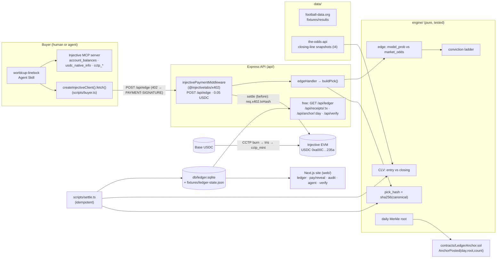

# Architecture — LineLock (as built)

## System



## Request paths

| Route | Gate | Handler | Returns |
|---|---|---|---|
| `POST /api/edge` | **x402 0.05 USDC** | `edgeHandler` | `{fixture, model_prob, market_odds, edge_pct, ladder[], similar_settled[], pick_hash, receipt?}` |
| `GET /api/ledger` | free, CORS | `ledgerHandler` | all settled rows + stats + I3 check |
| `GET /api/receipts/:tx` | free | `receiptHandler` | pick↔receipt binding, I1 delta, I2 re-hash |
| `GET /api/anchor/:day` | free | `anchorHandler` | daily Merkle root + per-pick proofs (I5) |
| `GET /api/verify` | free | `verifyHandler` | quote, usdc info, CCTP, bench, receipts feed |
| `GET /health` | free | `healthHandler` | row/receipt counts, active network |

## x402 wiring (the lines that matter — real signature)

```ts
import { injectivePaymentMiddleware } from '@injectivelabs/x402/middleware';

app.use(injectivePaymentMiddleware(
  { 'POST /api/edge': {
      description: '…',
      accepts: [{ network: 'eip155:1776', asset: USDC_MAINNET, amount: '50000',
                  payTo: PAYTO_ADDRESS, maxTimeoutSeconds: 120 }] } },
  { facilitator: { privateKey: FACILITATOR_PK, confirmations: 1 },
    settlementPolicy: 'before' }   // handler sees req.x402.txHash → binds pick_hash→tx
));
```

`settlementPolicy: 'before'` = verify → settle → run handler, so `edgeHandler` binds `pick_hash` to the
receipt tx in one ledger row with zero extra RPC. Emitting the 402 quote itself needs **no funds**.

## Data flow (the one deep flow)
1. Agent checks USDC via MCP → `POST /api/edge` → **402** with the x402 quote.
2. `createInjectiveClient().fetch()` signs EIP-3009 → facilitator settles → **receipt tx** (block time
   < kickoff = I1).
3. `edgeHandler` returns the edge + ladder + `pick_hash`, binding the receipt as a `pending` ledger row.
4. `settle.ts` freezes the closing line (I4), computes CLV, and publishes the row to `GET /api/ledger`.
5. `LedgerAnchor` commits the day's Merkle root (I5); `linelock-audit --all` diffs DB vs chain.

## Invariants → code
I1 `settle.ts:assertPreKickoff` · I2 `engine/hash.ts` + browser re-verify · I3 `db/ledger.ts:receiptCount`
· I4 `data/odds.ts:closingLineFromSnapshots` · I5 `engine/merkle.ts` + `contracts/LedgerAnchor.sol`.
